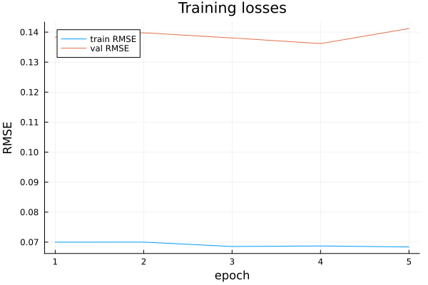
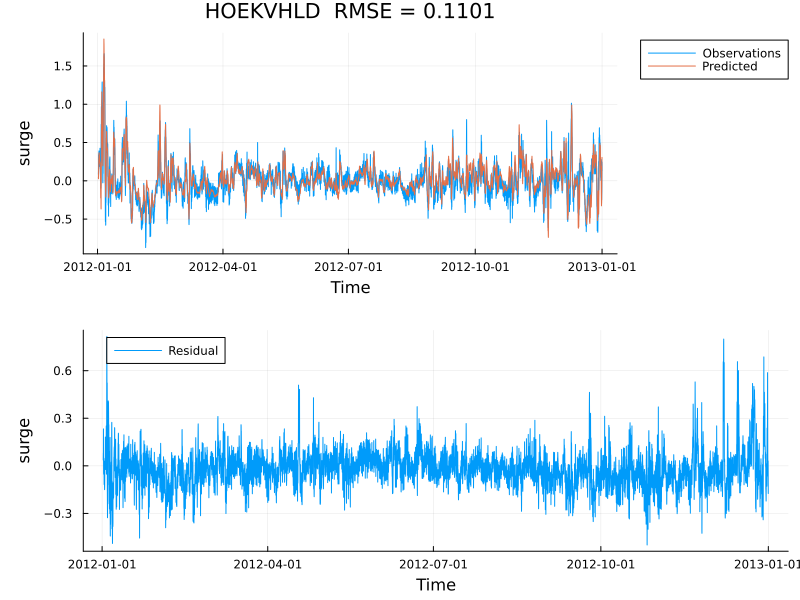

A Julia package for ML-based point forecasting of water levels at coastal stations.
Inputs come from ERA5 reanalysis; outputs are tides, storm surge, waves, and their interaction at a set of stations.

## Overview

Total water level is decomposed into three additive components:

$$\eta_\text{total} = \eta_\text{tide} + \eta_\text{surge} + \eta_\text{interaction}$$

Each component is modelled by a separate neural network trained on DCSM-FM reanalysis output.

There is also some preliminary work on modeling waves.

## Quick start

This assumes the software is already installed — see [Installation](installation.qmd) for step-by-step instructions.

Training is driven by a TOML config file. Here is the example for `ConvSurgeModel`:

```toml
[run_info]
runid       = "example"
description = "Convolutional surge model: 2010 train, 2011 validation, 2012 test."

[model_settings]
model_name = "ConvSurgeModel"
nlags      = 16

[model_settings.model_pars]
channels   = [32, 16]
filtersize = 3

[train_settings]
nepochs         = 50
learning_rate   = 1.0e-3
patience        = 5

[data_settings.model_io]
input  = ["stress_x", "stress_y", "pressure"]
target = ["surge"]

[[data_settings.files]]
path      = "surge_schureman_2010.nc"
split     = "training"
variables = ["surge"]

[[data_settings.files]]
path      = "era5_wind_stress_2010.jld2"
split     = "training"
variables = ["stress_x", "stress_y", "pressure"]
```

The key sections are:

- `[run_info]` — a unique `runid` used to name the output directory and leaderboard entry
- `[model_settings]` — which model to use and its architecture parameters; see [settings reference](settings.md)
- `[train_settings]` — epochs, learning rate, early stopping patience
- `[data_settings]` — which variables are inputs/targets and where the data files are; see [data input settings](data_input_settings.md)

Run training with:

```bash
bin/train examples/ConvSurgeModel.toml
```

## Example results

After training, output is written to `examples/training_output/example_ConvSurgeModel/`.
The loss curve shows train and validation RMSE per epoch:



And the predicted surge timeseries at Hoek van Holland on the test period (RMSE = 0.110 m):



## Documentation

- [Background](background.md) — concepts and motivation
- [Settings reference](settings.md) — all model and training settings
- [Data input settings](data_input_settings.md) — how to configure data loading
- [Output settings](output_settings.md) — how to configure model outputs

## Presentation

An overview of the models and current results:
<https://deltares-research.github.io/AIHydroPoints.jl/presentations/index.html>
