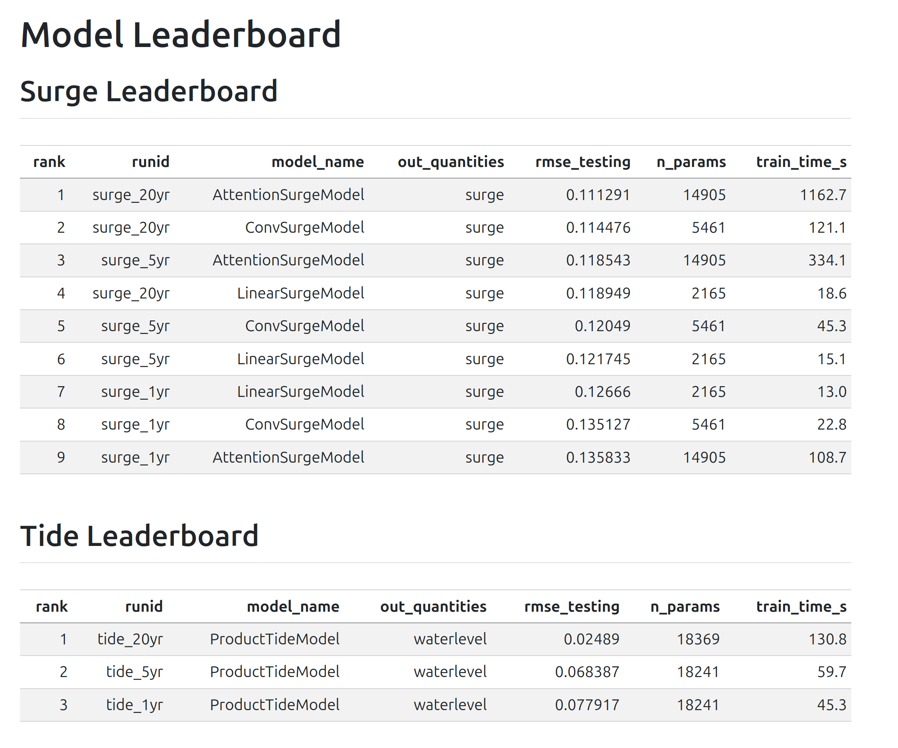
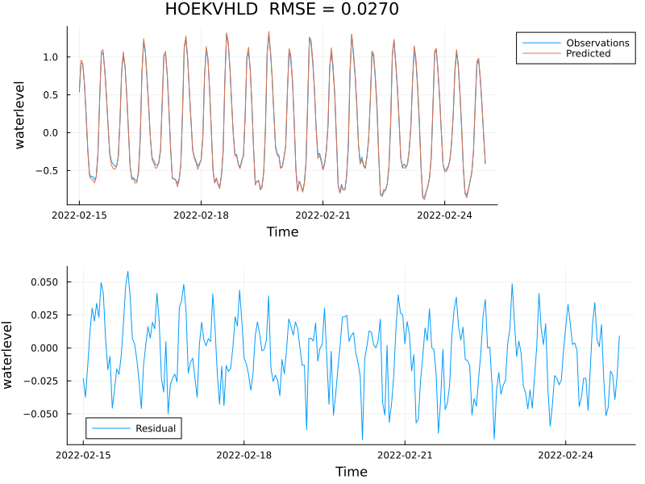
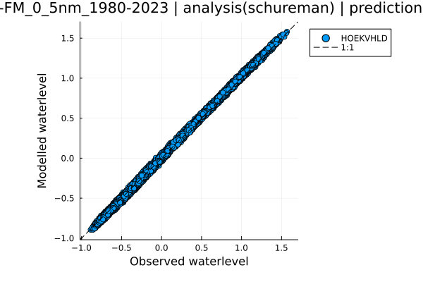
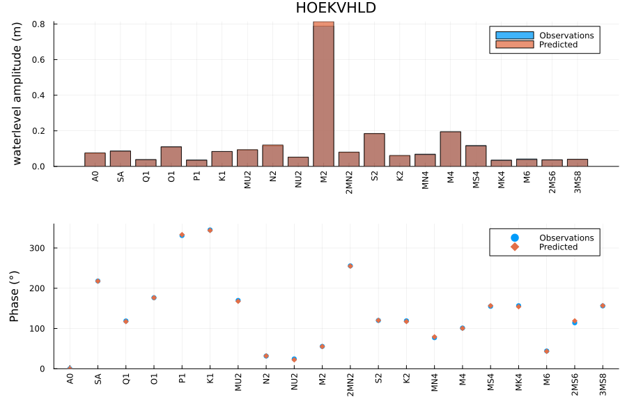
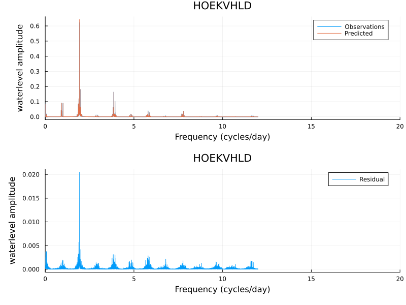
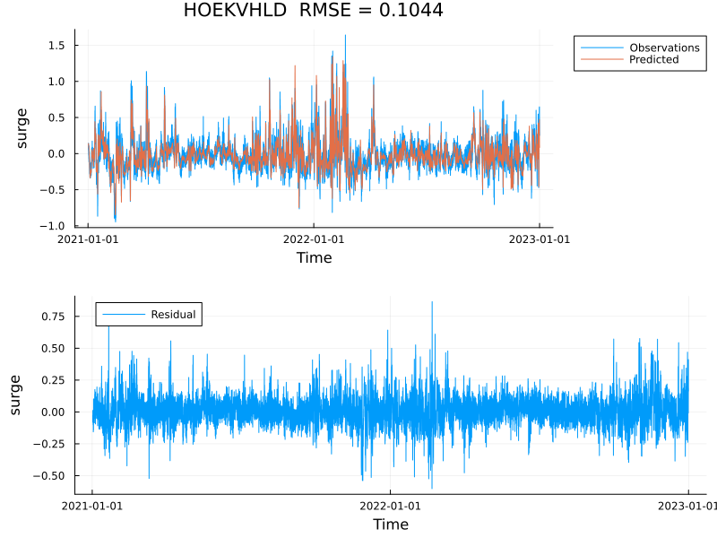
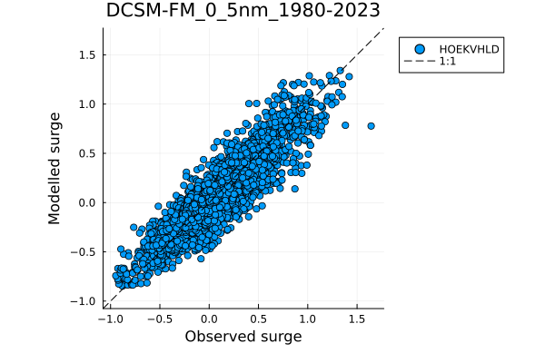
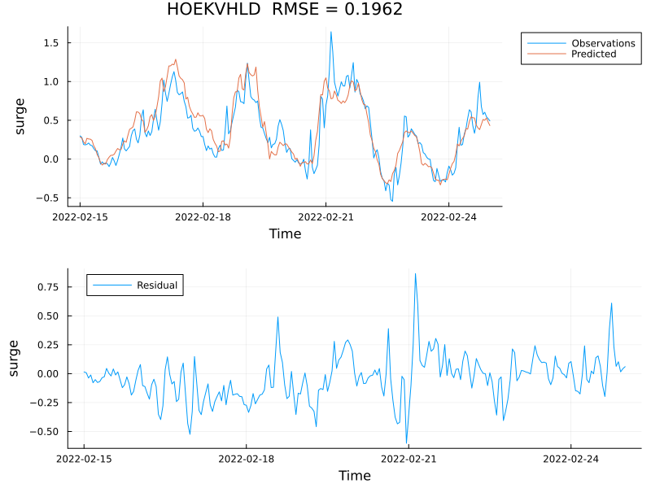
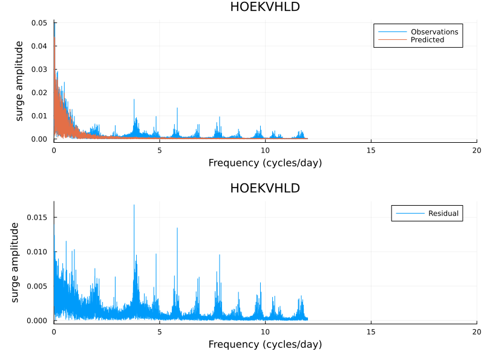

## Predicting ocean water levels at points

**The goal:** accurate, fast water level forecasts at coastal stations

::: {style="font-size: 0.8em;"}
- Needed for flood warnings, port operations, and coastal management
- Traditional approach: run a full 3-D numerical model (expensive)
- Alternative: train an ML model on output from a numerical reanalysis (DCSM-FM)
:::

. . .

**This project:** a Julia package (`AIHydroPoints`) for ML-based point forecasting

## The traditional approach: numerical models

Numerical models (e.g. Delft3D-FM) solve the shallow-water equations on a grid

| | |
|---|---|
| **Strengths** | Physics-based; works anywhere on the grid |
| **Limitations** | Slow; output at a point is a by-product of a large spatial solve |

. . .

**ML models learn the input → point-output mapping directly from reanalysis data**

## Four phenomena: tides, surge, waves, and their interaction

$$\eta_\text{total} = \eta_\text{tide} + \eta_\text{surge} + \eta_\text{wave} + \eta_\text{interaction}$$

::: {style="font-size: 0.8em;"}
| Component | Driver | Status |
|---|---|---|
| **Tides** | Astronomical forcing | baseline done |
| **Storm surge** | Wind stress + pressure | baseline done |
| **Waves** | Wind fields | planned |
| **Interaction** | Nonlinear tide–surge coupling | in progress |
:::

## Inputs and outputs

**5 output stations** — Dutch North Sea coast

Vlissingen · Hoek van Holland · Den Helder · Harlingen · Delfzijl

. . .

**Inputs vary by component**

::: {style="font-size: 0.8em;"}
| Component | Input variables | # Input locations | # Lags |
|---|---|---|---|
| Surge | Wind stress (x, y) + pressure | 9 | 16 h |
| Tide | Time + selected constituents | — | — |
| Waves | Wind speed + direction | 9 | 16 h |
| Interaction | Tide + surge predictions | 5 | 16 h |
:::

All inputs come from ERA5 reanalysis (hourly, ~0.25° grid).

## Tides

Tides are almost entirely predictable from the positions of the Moon and Sun.

**Model input:** time only (no atmospheric data needed)

::: {style="font-size: 0.8em;"}
- Converts datetime → 6 Doodson astronomical components
- Components: lunar hour angle *T*, solar declination *S*, solar hour *H*, lunar longitude *P*, lunar node *N*, solar perigee *P₁*

- `ProductTideModel` — learned amplitude/phase per constituent
- `DeepONetTideModel` — deep operator network
:::

Tides contribute the dominant signal (~80% of variance at most stations).

## Storm surge

**Physical mechanism:** wind pushes water toward (or away from) the coast; low pressure raises sea level

**Model input:** ERA5 wind stress (x, y) + mean sea-level pressure at 9 grid points, with 16-hour lag window

- `LinearSurgeModel` — single dense layer; 2,165 parameters
- `ConvSurgeModel` — 1-D convolution over time lags; 5,461 parameters
- `AttentionSurgeModel` — self-attention over lag window

## Waves — sea-state from wind fields

Wave statistics (significant wave height, period) driven by local and upstream wind.

**Model input:** wind speed + direction at ERA5 grid points + one-hot station encoding

**Models available**

- `ConvWaveModel` — convolutional over spatial/temporal lags
- `DeepONetWaveModel` — operator network

::: {style="font-size: 0.8em; margin-top: 1em;"}
*Wave baselines are planned; results not yet in leaderboard.*
:::

## Tide–surge interaction — why 1 + 1 ≠ 2

In shallow water, tides and surges are not independent:

- A surge arriving at low tide propagates differently than at high tide
- Bottom friction is nonlinear: $\tau_b \propto |\mathbf{u}|\mathbf{u}$
- The residual (total − tide − surge) can reach tens of centimetres

**Model input:** predicted tide + surge at all stations, 16-hour lag window

::: {style="font-size: 0.8em; margin-top: 1em;"}
*Active area of work — convergence issues under investigation.*
:::

## Training a model {.smaller}

```bash
bin/train examples/ConvSurgeModel.toml
```

```toml
[run_info]
runid       = "example"
description = "Convolutional surge model: 2010 train, 2011 validation, 2012 test."

[model_settings]
model_name = "ConvSurgeModel"
nlags      = 16

[train_settings]
nepochs         = 50
learning_rate   = 1.0e-3
patience        = 5

[data_settings.model_io]
input  = ["stress_x", "stress_y", "pressure"]
target = ["surge"]

[[data_settings.files]]
path      = "surge_schureman_2010.nc"
split     = "training"
variables = ["surge"]

[[data_settings.files]]
path      = "era5_wind_stress_2010.jld2"
split     = "training"
variables = ["stress_x", "stress_y", "pressure"]
```

## Leaderboard: comparing models

{fig-align="center" height="500"}

## Tide performance — Hoek van Holland {.smaller}

:::: {.columns}
::: {.column width="50%"}
{fig-align="center" width="100%"}
:::
::: {.column width="50%"}
{fig-align="center" width="100%"}
:::
::::

- `ProductTideModel` trained on 20 yr of DCSM-FM data; RMSE = **0.025 m** at Hoek van Holland
- Scatter plot nearly perfect — tidal signal is highly predictable from astronomical forcing alone

## Tide performance — tidal constituents {.smaller}

:::: {.columns}
::: {.column width="50%"}
{fig-align="center" width="100%"}
:::
::: {.column width="50%"}
{fig-align="center" width="100%"}
:::
::::

- Constituent amplitudes and phases match well; dominant M2 constituent correctly captured
- Using 20 years of data the nodal factor (~18.6 yr cycle) can also be estimated

## Surge performance — Hoek van Holland {.smaller}

:::: {.columns}
::: {.column width="50%"}
{fig-align="center" width="100%"}
:::
::: {.column width="50%"}
{fig-align="center" width="100%"}
:::
::::

- `ConvSurgeModel` trained on 20 yr; RMSE = **0.114 m** on test period (2021–2022)
- Scatter shows more spread than tides — surge is inherently harder to predict

## Surge performance — frequency content {.smaller}

:::: {.columns}
::: {.column width="50%"}
{fig-align="center" width="100%"}
:::
::: {.column width="50%"}
{fig-align="center" width="100%"}
:::
::::

- Training period series (RMSE = 0.196 m) shows large events well captured, some misses on peaks
- FFT residual shows energy remaining at tidal frequencies — signature of tide–surge interaction not yet modelled

## Open question: the interaction model

The interaction residual (total − tide − surge) is small but matters for extremes.

**Challenge:** the signal is ~5–20 cm, highly nonlinear, and correlated with both tide phase and surge amplitude.

**Current status**

- `ConvInteractionModel` and `ProductInteractionModel` implemented and passing unit tests
- Training does not converge — loss plateaus near the mean
- Likely causes: insufficient signal-to-noise ratio, or missing input features

**Next steps:** diagnose convergence, try predicting on synthetic interaction data first.

## A shared ML architecture for all components

All models share the same abstract interface (`AbstractFluxModel`):

```
AbstractModel
└── AbstractFluxModel
        ├── AbstractSurgeModel  →  Linear / Conv / Attention
        ├── AbstractTideModel   →  Product / DeepONet
        ├── AbstractWaveModel   →  Conv / DeepONet
        └── AbstractInteractionModel  →  Conv / Product
```

Every model implements three customization points:

- `preprocess` — build input tensor from `Dict{String, TimeSeries}`
- `forward` — Flux neural network pass
- `postprocess!` — write predictions back into output dict

Generic `predict`, `save_params`, `load_params!` are inherited for free.

## What's working, what's next

::: {style="font-size: 0.8em;"}
**Working**

- Full model hierarchy: 12 concrete models across 4 families
- 543 unit tests pass; all training scripts smoke-tested
- TOML-driven training/prediction pipeline
- Surge and tide baselines on 1 yr / 5 yr / 20 yr training data
- Automatic leaderboard generation

:::: {.columns}
::: {.column width="50%"}
**In progress**

- Interaction model convergence
- Wave model baselines
- Scatter plot improvements
:::
::: {.column width="50%"}
**Planned**

- Real-time forecast scripts
- Scale to more stations
- Online demo environment
:::
::::
:::
