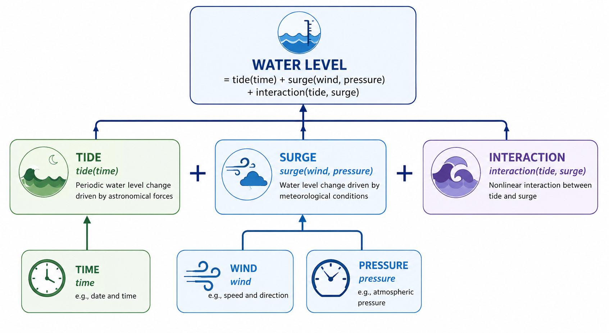
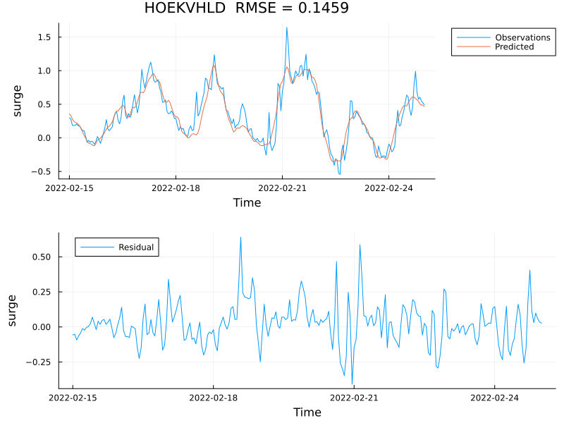
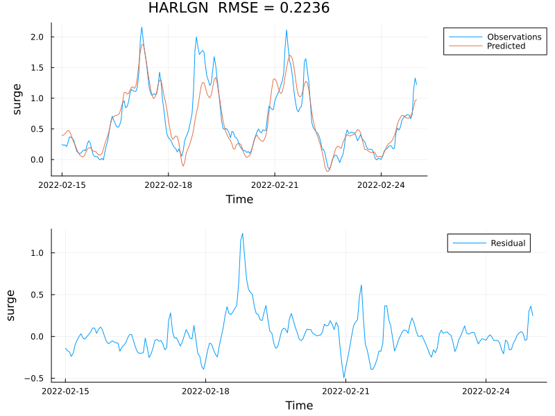
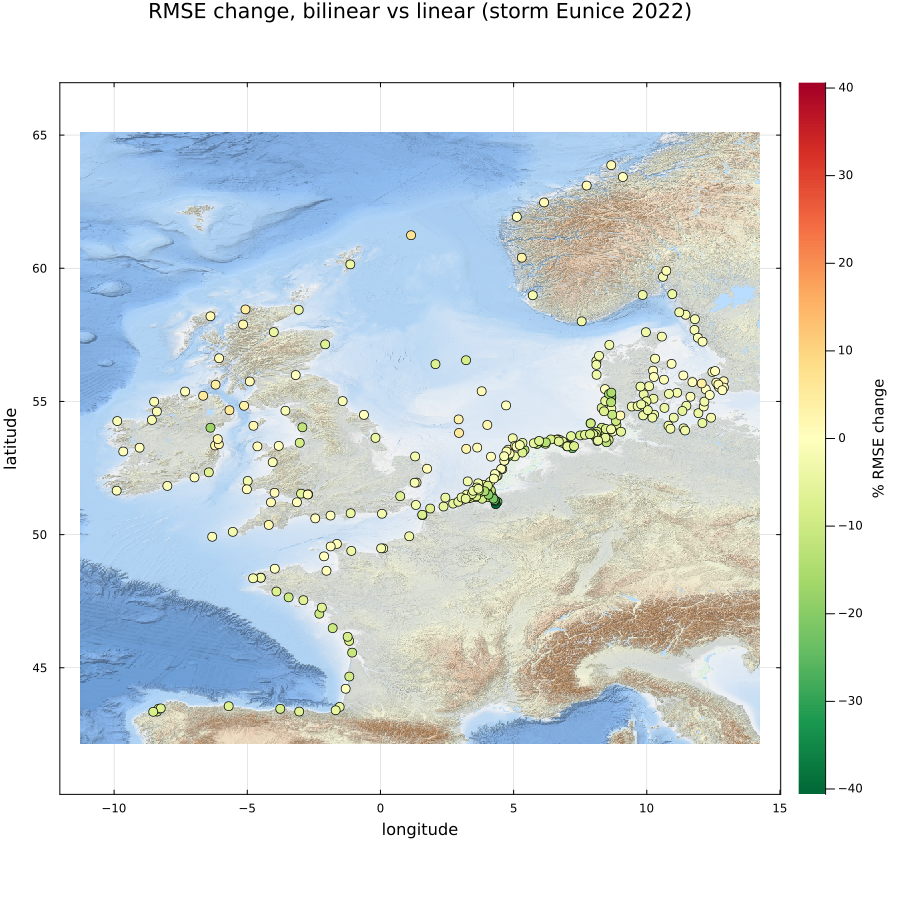
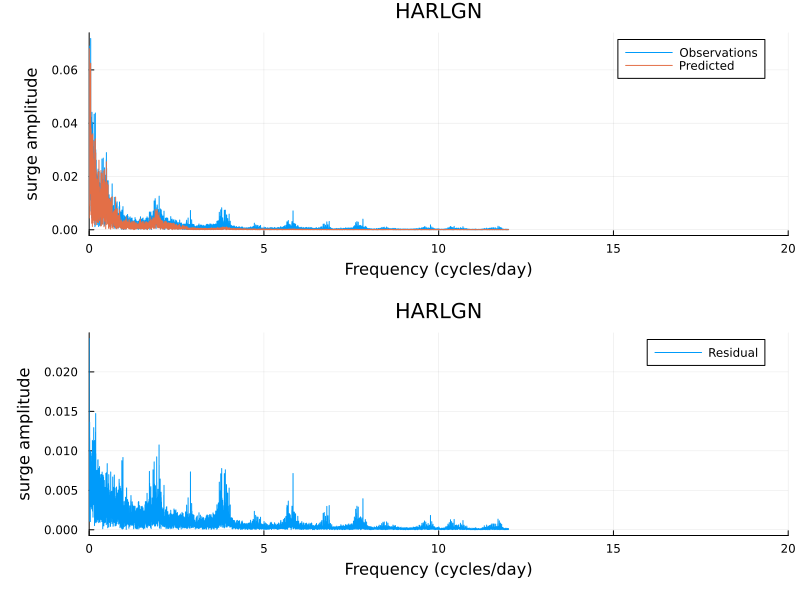
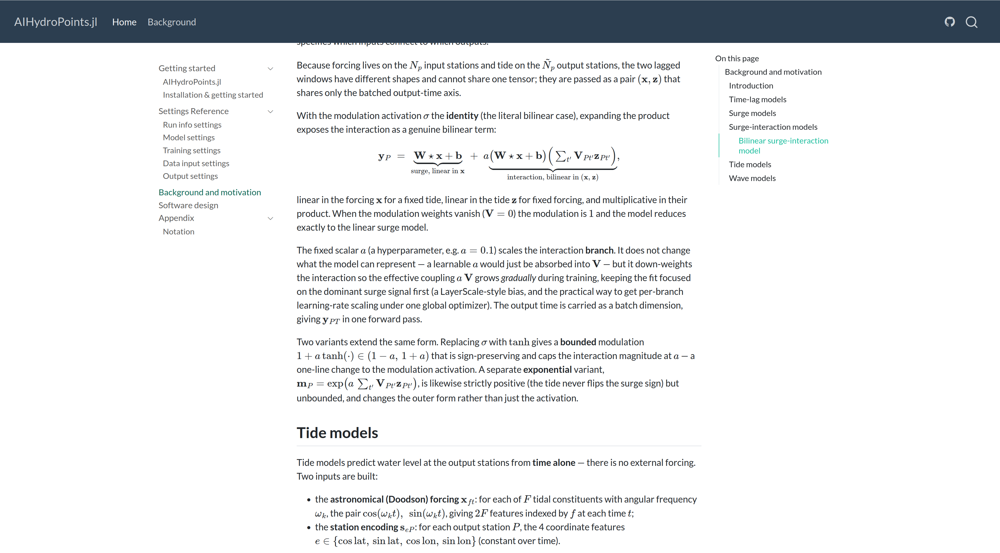
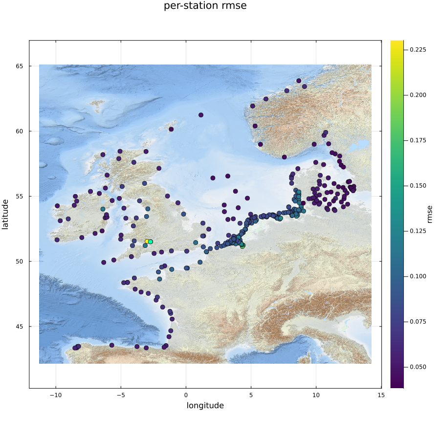
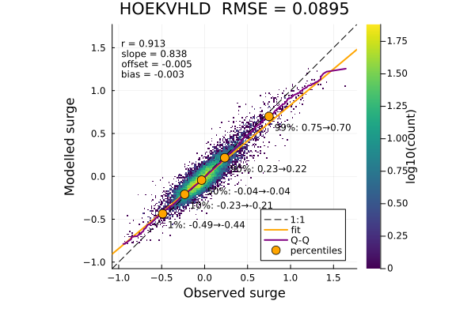

## Outline

::: {style="font-size: 0.8em;"}
- AIHydroPoints goals
- Models — development of tide-surge interaction models
- Training — sweeps, scaling to 317 stations
- Code improvements — refactor, TOML format, bug fixes
- New functionality — TOML-driven output, visualization
:::

## AIHydroPoints goals

**Fast, accurate and reliable ML water-level forecasts**

::: {style="font-size: 0.8em;"}
**What:** tide + surge + interaction, at many locations in a single model

**How:** trained on DCSM-FM reanalysis + ERA5 forcing; one shared model architecture; TOML-configured — train and forecast without writing code

**Bar:** cheaper than running the full numerical model; production-grade code and model quality — version control, unit tests, continuous smoke-testing
:::

## Recap {.smaller}

Since the [project overview](../overview/index.html) on 28 May 2026 (~2 months ago):

{fig-align="center" width="85%"}

::: {style="font-size: 0.75em;"}
- Tide and surge baselines established (1 yr / 5 yr / 20 yr)
- Model hierarchy (`AbstractFluxModel`) in place across all four components
- Baselines back then: harmonic analysis for tides, `LinearSurgeModel` for surge — interaction wasn't working yet
:::

## Models — revisiting the physics-based split

Two of the three pieces from the recap diagram you've already seen — today's news is the third.

. . .

**Linear surge benchmark** (the baseline used throughout)

$$s = W_s[\tau_x, \tau_y, p] + b$$

::: {style="font-size: 0.8em;"}
Dense, all-to-all fit of wind stress + pressure → surge at every output station.
:::

## New: bilinear surge-interaction model {.smaller}

Multiply the linear surge by a tide-driven correction:

$$y = s \cdot \big(1 + a\,\sigma(V h)\big)$$

::: {style="font-size: 0.8em;"}
- $s$ — the linear surge above
- $h$ — the (lagged) tide at that station
- $V$ — a per-station tide weight; $a$ — a small fixed scale (e.g. 0.5)
:::

. . .

::: {style="font-size: 0.75em;"}
- $V$ starts at **zero** → the model starts out *exactly* the linear surge model, then learns the tidal correction from there
- Expanding: $y = s + a\,s\,(Vh)$ — linear in the forcing and linear in the tide separately, but their product makes it genuinely nonlinear
:::

## Surge-interaction — storm result {.smaller}

Comparing `BiLinearSurgeInteractionModel` against the matching `LinearSurgeModel`
(same `nlags = 48`, same training settings), storm Eunice 2022:

:::: {.columns}
::: {.column width="50%"}
**Hoek van Holland** (open coast)

RMSE: 0.149 → 0.146 (<span style="color:#4ade80">−2.2%</span>)

{fig-align="center" width="100%"}
:::
::: {.column width="50%"}
**Harlingen** (shallow Wadden Sea)

RMSE: 0.260 → 0.224 (<span style="color:#4ade80">−14.1%</span>)

{fig-align="center" width="100%"}
:::
::::

::: {style="font-size: 0.75em;"}
- RMSE shown as linear → bilinear, both `nlags=48`
- All 317 stations, mean RMSE: testing <span style="color:#4ade80">−3.2%</span>, storm Eunice <span style="color:#4ade80">−6.7%</span>
- Confirms the earlier finding: interaction gain concentrates in shallow water (Harlingen), much smaller on the open coast (Hoek van Holland)
:::

## Surge-interaction — where does it help? {.smaller}

RMSE change per station, bilinear vs. linear (`nlags=48`, storm Eunice 2022; negative = improvement):

{fig-align="center" width="65%"}

::: {style="font-size: 0.75em;"}
Greenest cluster sits right on the Dutch/German Wadden coast — the shallow estuaries where tide–surge coupling is strongest. One outlier station (Norwegian coast) regresses slightly.
:::

## Surge-interaction — not fully there yet {.smaller}

Harlingen, testing period — residual (observed − predicted) spectrum still has peaks:

{fig-align="center" width="70%"}

::: {style="font-size: 0.75em;"}
- Peaks at 2, 4, 6, 8 cycles/day — exactly the tidal overtides (M2, M4, M6, M8)
- The bilinear model only captures part of the tide–surge coupling; higher-order nonlinear terms remain unmodelled
- The same station with the biggest gain (previous slide) still has the clearest leftover signal
:::

## Training {.smaller}

::: {style="font-size: 0.8em;"}
- Hyperparameter sweeps (ongoing) — `scripts/parameter_sweep.jl`
- Scaling to the full 317-station dataset
:::

**Example: lag-window sweep** (`BiLinearSurgeInteractionModel`, 317 stations, 5 yr)

::: {style="font-size: 0.7em;"}
| nlags (h) | RMSE testing (m) | Δ testing | RMSE storm Eunice (m) | Δ storm |
|---|---|---|---|---|
| 12 | 0.094 | <span style="color:#f87171">+5.5%</span> | 0.166 | <span style="color:#f87171">+8.7%</span> |
| 16 (baseline) | 0.089 | — | 0.153 | — |
| 24 | 0.083 | <span style="color:#4ade80">−6.8%</span> | 0.138 | <span style="color:#4ade80">−10.0%</span> |
| **48** | **0.080** | <span style="color:#4ade80">**−9.7%**</span> | **0.137** | <span style="color:#4ade80">**−10.3%**</span> |
:::

::: {style="font-size: 0.65em;"}
- Weight decay: light L2 (`5e-5`) helps a little; more (`5e-4`, `1e-3`) clearly hurts — now the default
- Learning-rate decay: mild decay (`factor=0.5`) beats aggressive decay, and edges out our current `0.2` — worth revisiting
- Batch size sweep still running
:::

::: {style="font-size: 0.7em;"}
Longer lag windows keep helping up to 48h.
:::

## Code improvements {.smaller}

::: {style="font-size: 0.65em;"}
**Goal:** configure and run any model family the same way — swap the model, not the training script
:::

::: {style="font-size: 1.4em;"}
```
AbstractModel
└─ AbstractFluxModel
    ├─ AbstractTideModel   →  Product / DeepONet
    └─ AbstractSurgeModel  →  Linear / Conv / Attention
        └─ AbstractSurgeInteractionModel → BiLinear
```
:::

::: {style="font-size: 0.6em;"}
- Locked-down TOML schema — breaking changes now versioned (`format_version`), bad configs caught at load time instead of failing mid-run
- Single training routine replacing per-model scripts
- Documentation

**Bug fixes**

- Training knobs lost in the refactor, restored: early stopping, weight decay, input noise
- Learning-rate decay regression (accidentally omitted, restored)
- Windows compatibility (pixi win64, script robustness)
:::

## Documentation — background.md {.smaller}

The model derivations (e.g. the bilinear surge-interaction expansion from earlier)
now live in a rendered docs site, not just source comments:

{fig-align="center" width="75%"}

::: {style="font-size: 0.7em;"}
<https://deltares-research.github.io/AIHydroPoints.jl/background.html>
:::

## New functionality — TOML-driven {.smaller}

::: {style="font-size: 0.8em;"}
Cleaned up TOML input files:
:::

::: {style="font-size: 0.68em;"}
```toml
format_version = 2

[model_settings]
model_name = "LinearSurgeModel"
nlags      = 48

[train_settings]
nepochs               = 50
batch_size            = 64
learning_rate         = 1.0e-3
lr_decay_factor       = 0.2
lr_decay_epochs       = 10
early_stopping_epochs = 25
weight_decay          = 5.0e-5

[data_settings.model_io]
input  = ["stress_x", "stress_y", "pressure"]
target = ["surge"]

[[data_settings.files]]
path      = "surge_schureman_..._317stations.jld2"
split     = "training"
variables = [{name = "values", as = "surge"}]

[[data_settings.files]]
path      = "era5_..._wind_stress_x.jld2"
split     = "training"
variables = [{name = "values", as = "stress_x"}]

[output_settings]
write_summary = true
series_format = "netcdf"

    [[output_settings.outputs]]
    split        = "testing"
    plot_stats   = true
    plot_scatter = true
```
:::

## New functionality — visualization {.smaller}

`BiLinearSurgeInteractionModel`, `nlags=48`, testing split (317 stations):

:::: {.columns}
::: {.column width="45%"}
**Per-station RMSE map**

{fig-align="center" width="100%"}
:::
::: {.column width="55%"}
**Scatter — Hoek van Holland**

{fig-align="center" width="100%"}
:::
::::

## What's next

::: {style="font-size: 0.8em;"}
- Complete hyper-parameter sweeps and training for North Sea
- Lake training
- Training world-wide GTSM surrogate (FUTURA)
- Online demo of North Sea model (format TBD)
- Storage for new and larger datasets
:::
